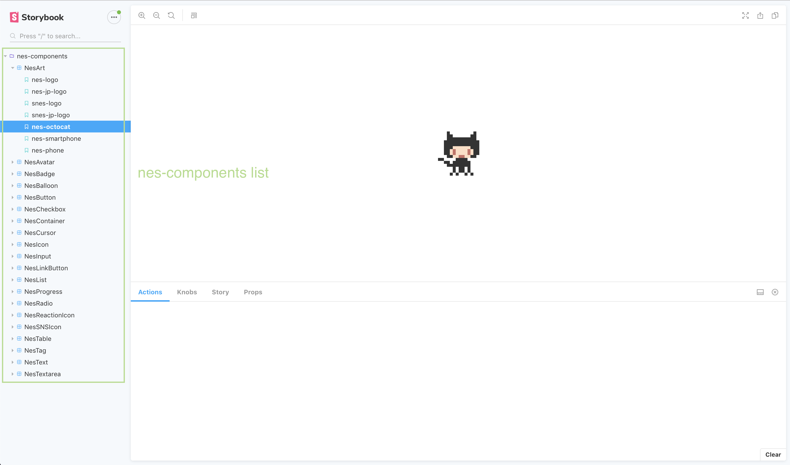

# nes-components

### What is `nes-components`?
`nes-components` is a react component which is using NES.css.

### What is `NES.css`?
NES.css is a NES-style(8bit-like) CSS Framework.
https://github.com/nostalgic-css/NES.css

### How to use this?

#### install
```
$ yarn add nes-components
$ npm i nes-components
```

## caution
if nes-components doesn't show the right font, please add the following to your component.
Currently, working on updating nes-components
```js
import WebFont from 'webfontloader';
WebFont.load({
  google: {
    families: ['Press+Start+2P'],
  },
});
```

#### Doc
Please see StoryBook https://nes-components.netlify.com/    

#### samples ToDo
Sample codes are in Storybook(`Typescript`).
Please check it out.
`js` samples will be added soon.


### Use Storybook
```
$ cd nes-components
$ yarn & yarn storybook
or
$ npm i & npm run storybook
```
The terminal will open [localhost:9009](localhost:9009).

You will see like below.



